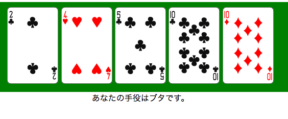
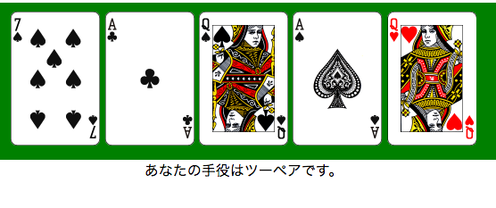

# ポーカー
## 仕様
<br/>
<br />
画面の目標は上図です。余裕がある方は自分の理想を目指してください。<br />
<br />
1. ジョーカーを抜いた52枚のカードを使用します。<br />
2. 52枚のカードからランダムに5枚のカードを手札とし、画面に表示させてください。<br />
3. 下図のように役判定もしてください。（役判定については後述します。）<br />

<br/>

## 素材
* トランプ画像 => `image_trump/` <br />
gif画像とpng画像があります。お好きな方を利用してください。

* 役判定クラス => `poker.php`
後述します。

## 提出方法
確認します。

## 役判定クラスについて
`poker.php`内の`getYaku`メソッドを呼ぶことで現在の手札の役を判定します。<br />
ただし、以下の条件があります。<br />
* カード1枚1枚に、連想配列で`number`（数字）と`mark`（マーク）をもたせてください。<br />

```php
// 例：スペードの10
"number" => 10, "mark" => spades

/*
マークは揃っていれば何でもいいですが、悩むのが面倒な方は、
スペード => spades
ハート	=> hearts
ダイヤ	=> diams
クラブ	=> clubs
としましょう。
*/
```

* 5枚の手札は連想配列で以下のようにし、これを`poker.php`内の`getYaku`メソッドに渡してください。
（手札はそのときそのときで変わります。また、以下の連想配列はあくまで一例です。）

```php
// 手札
$myHand = array(
	array("number" => 12, "mark" => "clubs"),	// クラブのクイーン
	array("number" =>  7, "mark" => "hearts"),	// ハートの7
	array("number" =>  1, "mark" => "spades"),	// スペードのA
	array("number" =>  8, "mark" => "spades"),	// スペードの8
	array("number" =>  6, "mark" => "hearts"),	// ハートの6
	);
```